# Instalación y Configuración: Entorno WSL Ubuntu 24.04 con Docker y MySQL

Este documento detalla el paso a paso de la configuración inicial de un entorno de desarrollo utilizando **WSL (Ubuntu 24.04)**, la instalación de **Docker** y **Docker Compose**, la estructuración del proyecto mediante directorios organizados, y el despliegue de un contenedor de **MySQL 8.0** con persistencia y variables de entorno.

------------------------------------------------------------------------

## 1. Inicialización y Actualización de WSL (Ubuntu 24.04)

Al iniciar una nueva instancia de WSL con Ubuntu 24.04, se configura la cuenta de usuario UNIX y se procede con la actualización del sistema operativo y sus repositorios.

``` bash
# Actualizar los repositorios e instalar actualizaciones del sistema
sudo apt update && sudo apt upgrade -y
```

------------------------------------------------------------------------

## 2. Instalación de Docker y Docker Compose en Ubuntu 24.04

Si Docker no se encuentra instalado inicialmente en el sistema, se procede con la configuración del repositorio oficial de Docker e instalación de los paquetes necesarios.

### Configuración del repositorio y dependencias:

``` bash
sudo apt-get update
sudo apt-get install ca-certificates curl
sudo install -m 0755 -d /etc/apt/keyrings
sudo curl -fsSL https://download.docker.com/linux/ubuntu/gpg -o /etc/apt/keyrings/docker.asc
sudo chmod a+r /etc/apt/keyrings/docker.asc

echo \
  "deb [arch=$(dpkg --print-architecture) signed-by=/etc/apt/keyrings/docker.asc] https://download.docker.com/linux/ubuntu \
  $(. /etc/os-release && echo \"$VERSION_CODENAME\") stable" | \
  sudo tee /etc/apt/sources.list.d/docker.list > /dev/null

sudo apt-get update
```

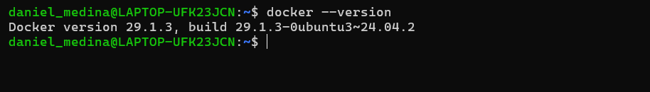

### Instalación de Docker Engine y Docker Compose v2:

``` bash
sudo apt install docker.io -y
sudo apt install docker-compose-v2 -y
```

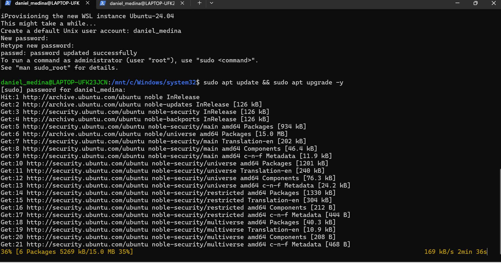

### Verificación de la instalación:

``` bash
docker --version
docker compose version
```

*Resultado esperado:* - `Docker version 29.1.3` - `Docker Compose version 2.40.3` 

## 3. Estructura de Directorios del Proyecto

Se crea la estructura base del laboratorio académico (`ia-lab-academica`) separando la capa de persistencia (`data`) y la capa de servicios (`services`).

### Creación de carpetas y contenedores de bases de datos:

``` bash
# Crear directorio principal
sudo mkdir -p ~/ia-lab-academica/data/{mysql,postgres,mssql,oracle}
sudo mkdir -p ~/ia-lab-academica/services/motores-bd/{mysql,postgres,mssql,oracle}
```

### Visualización del árbol de directorios ejecutando el comando tree:

``` bash
tree 
```

``` text
ia-lab-academica
├── data
│   ├── mssql
│   ├── mysql
│   ├── oracle
│   └── postgres
└── services
    └── motores-bd
        ├── mssql
        ├── mysql
        ├── oracle
        └── postgres
```

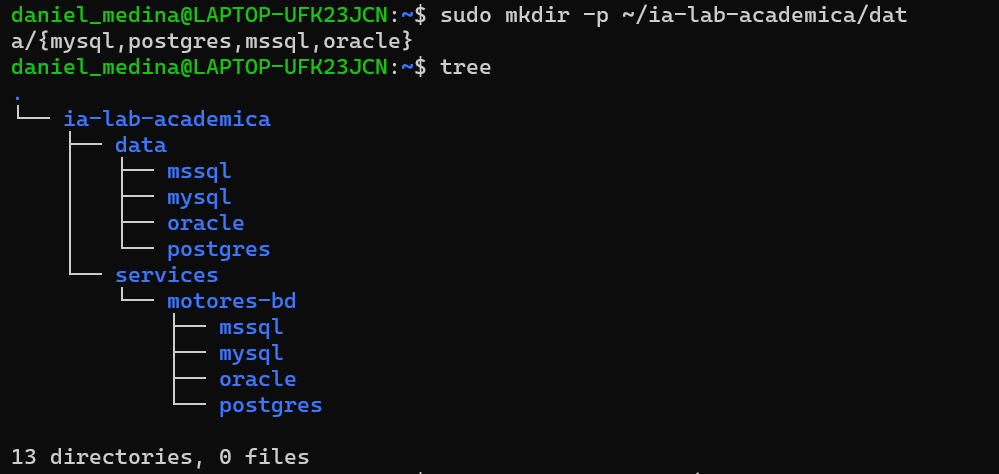

## 4. Configuración del Servicio MySQL 8.0

Dentro de la ruta de MySQL (`~/ia-lab-academica/services/motores-bd/mysql/`), se configuran los archivos de despliegue.

### 4.1. Archivo `docker-compose.yml`

``` yaml
services:
  mysql:
    image: mysql:8.0
    container_name: mysql-server
    restart: unless-stopped
    env_file:
      - .env
    ports:
      - "3306:3306"
    volumes:
      - ../../../data/mysql:/var/lib/mysql
      - /mnt/d/academia/bd:/backups
    command: >
      --character-set-server=utf8mb4
      --collation-server=utf8mb4_unicode_ci
      --bind-address=0.0.0.0
    networks:
      - ia-lab-network
    healthcheck:
      test: ["CMD", "mysqladmin", "ping", "-h", "localhost"]
      interval: 10s
      timeout: 5s
      retries: 5
      start_period: 30s

networks:
  ia-lab-network:
    external: true
```

### 4.2. Archivo de Variables de Entorno (`.env`)

``` env
TZ=America/Bogota
MYSQL_ROOT_PASSWORD=daniel123
MYSQL_DATABASE=tecnogua
```

## 

## 5. Despliegue y Validación del Contenedor

### Iniciar el contenedor en segundo plano:

``` bash
sudo docker compose up -d
```

## 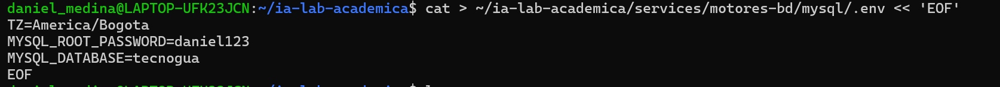

### Comprobar estado de los contenedores activos:

``` bash
sudo docker ps
```

------------------------------------------------------------------------

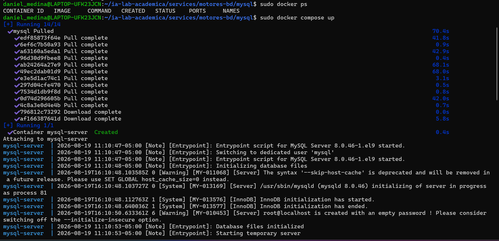

## 6. Conexión y Administración de la Base de Datos

### Conexión al contenedor MySQL desde la terminal local:

``` bash
sudo docker exec -it mysql-server mysql -u root -p  
```

*(Contraseña: `daniel123`)*

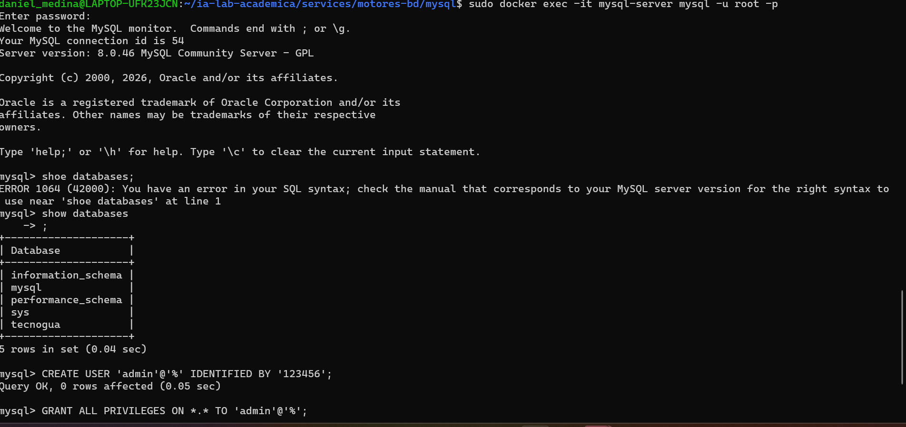

### Comandos SQL de verificación y configuración:

``` sql
-- Verificar bases de datos existentes
SHOW DATABASES;

-- Crear un nuevo usuario administrador con acceso remoto
CREATE USER 'admin'@'%' IDENTIFIED BY '123456';
GRANT ALL PRIVILEGES ON *.* TO 'admin'@'%';
```

------------------------------------------------------------------------

## 7. PostgreSQL

### 7.1. Crear docker-compose.yml

``` bash
cat > ~/ia-lab-academica/services/motores-bd/postgres/docker-compose.yml << 'EOF'
services:
  postgres:
    image: postgres:17
    container_name: ia-postgres
    restart: unless-stopped
    env_file:
      - .env
    ports:
      - "5433:5432"
    volumes:
      - ../../../data/postgres:/var/lib/postgresql/data
    networks:
      - ia-lab-network
    healthcheck:
      test: ["CMD-SHELL", "pg_isready -U $$POSTGRES_USER -d $$POSTGRES_DB"]
      interval: 10s
      timeout: 5s
      retries: 5
      start_period: 20s

networks:
  ia-lab-network:
    external: true
EOF
```

### 7.2. Crear .env

``` bash
cat > ~/ia-lab-academica/services/motores-bd/postgres/.env << 'EOF'
TZ=America/Bogota
POSTGRES_DB=ialab
POSTGRES_USER=ialab
POSTGRES_PASSWORD=medina123
PGDATA=/var/lib/postgresql/data
EOF
```

### 7.3. crear README.md

``` bash
cat > ~/ia-lab-academica/services/motores-bd/postgres/README.md << 'EOF'
# PostgreSQL 17 – Motor de Base de Datos

> **Acceso remoto habilitado.** Puerto expuesto en `0.0.0.0:5433`.
> **Usuario por defecto:** `ialab` (acceso remoto: sin restriccion de host)
```

## 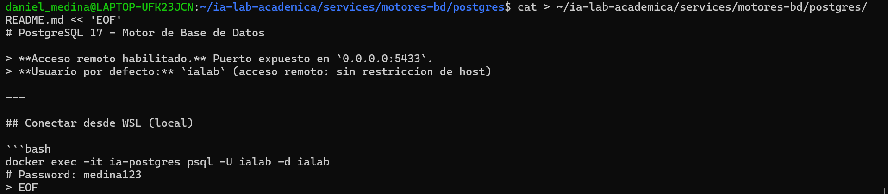

## Conectar desde WSL (local)

``` bash
docker exec -it ia-postgres psql -U ialab -d ialab
# Password: medina123
```

## Conectar remotamente desde cualquier equipo

``` bash
psql -h 172.20.100.80 -p 5433 -U ialab -d ialab
```

O con cliente grafico (pgAdmin, DBeaver): - **Host:** `172.20.100.80` - **Port:** `5433` - **User:** `ialab` - **Password:** `medina123**` - **Database:** `ialab`

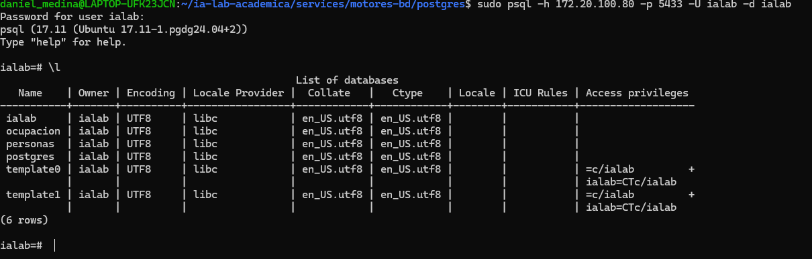 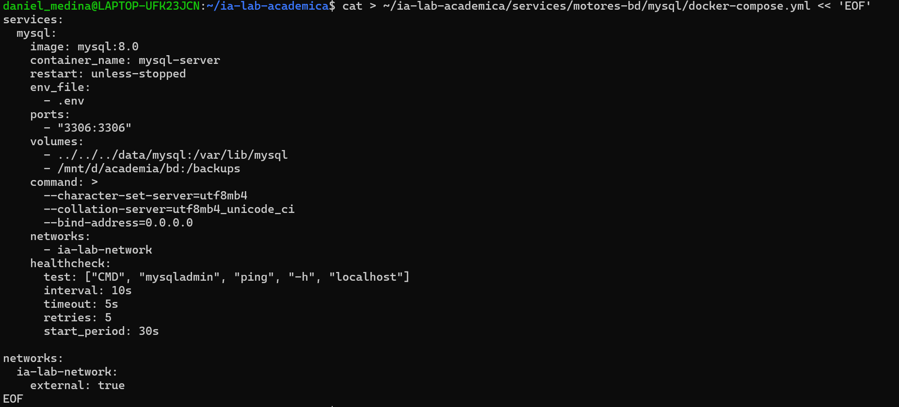

## Crear un usuario PROPIO con ACCESO REMOTO

``` bash

-- Crear la base de datos
CREATE DATABASE desarrollo;

-- Crear usuario propio con acceso
CREATE USER daniel WITH PASSWORD 'medina123';

-- Dar permisos sobre la base de datos
GRANT ALL PRIVILEGES ON DATABASE desarrollo TO daniel;

-- Asignar la propiedad de la base de datos al nuevo usuario
ALTER DATABASE dasarrollo OWNER TO daniel;
```

*resultado esoerado*

```         

                                                List of databases
    Name    | Owner | Encoding | Locale Provider |  Collate   |   Ctype    | Locale | ICU Rules | Access privileges
------------+-------+----------+-----------------+------------+------------+--------+-----------+-------------------
 desarrollo | ialab | UTF8     | libc            | en_US.utf8 | en_US.utf8 |        |           | =Tc/ialab        +
            |       |          |                 |            |            |        |           | ialab=CTc/ialab  +
            |       |          |                 |            |            |        |           | daniel=CTc/ialab
 ialab      | ialab | UTF8     | libc            | en_US.utf8 | en_US.utf8 |        |           |
 ocupacion  | ialab | UTF8     | libc            | en_US.utf8 | en_US.utf8 |        |           |
 personas   | ialab | UTF8     | libc            | en_US.utf8 | en_US.utf8 |        |           |
 postgres   | ialab | UTF8     | libc            | en_US.utf8 | en_US.utf8 |        |           |
 template0  | ialab | UTF8     | libc            | en_US.utf8 | en_US.utf8 |        |           | =c/ialab         +
            |       |          |                 |            |            |        |           | ialab=CTc/ialab
 template1  | ialab | UTF8     | libc            | en_US.utf8 | en_US.utf8 |        |           | =c/ialab         +
            |       |          |                 |            |            |        |           | ialab=CTc/ialab
(7 rows)
```

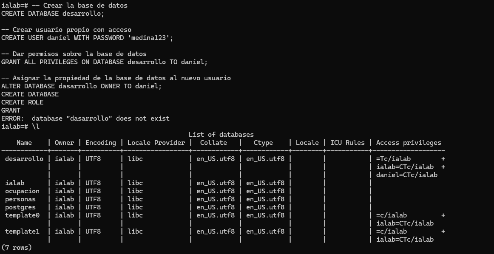

### 7.4 Levantar PostgreSQL

``` bash
cd ~/ia-lab/services/motores-bd/postgres
docker compose up -d
```

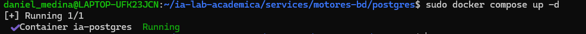

------------------------------------------------------------------------

## 8. SQL Server

### 8.1 Crear docker-compose.yml

``` bash
cat > ~/ia-lab/services/motores-bd/mssql/docker-compose.yml << 'EOF'
services:
  mssql:
    image: mcr.microsoft.com/mssql/server:2022-latest
    container_name: sqlserver-container
    restart: unless-stopped
    user: root
    env_file:
      - .env
    ports:
      - "1433:1433"
    volumes:
      - ../../../data/mssql:/var/opt/mssql
    networks:
      - ia-lab-network

networks:
  ia-lab-network:
    external: true
EOF
```

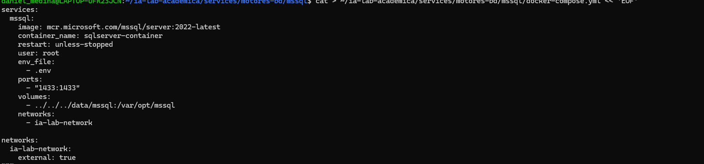

### 8.2. crear .env

``` bash
 cat > ~/ia-labacademica/services/motores-bd/mssql/.env << 'EOF'
ACCEPT_EULA=Y
MSSQL_SA_PASSWORD=daniel123
MSSQL_PID=Developer
EOF
```

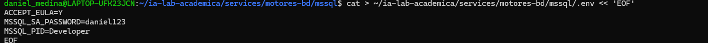

### 8.3. Crear README.md

``` bash
cat > ~/ia-lab/services/motores-bd/mssql/README.md << 'EOF'
# SQL Server 2022 - Motor de Base de Datos

> **Acceso remoto habilitado.** Puerto expuesto en `0.0.0.0:1433`.
> **Usuario por defecto:** `SA` (acceso remoto: habilitado por defecto)
EOF
```

## 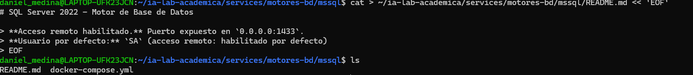

## levantar el servicio

``` bash
sudo docker compose up -d
```

------------------------------------------------------------------------

## Conectar desde WSL (local)

``` bash
docker exec -it sqlserver-container /opt/mssql-tools/bin/sqlcmd -S localhost -U SA -P 'daniel123'
```

## Conectar remotamente desde cualquier equipo

``` bash
sqlcmd -S 127.20.100.80 ,1433 -U SA -P 'daniel123'
```

O con cliente grafico (Azure Data Studio, DBeaver, SSMS): - **Host:** `127.20.100.80` - **Port:** `1433` - **User:** `SA` - **Password:** `daniel123`

## Crear un usuario PROPIO con ACCESO REMOTO

``` sql
-- Crear la base de datos
CREATE DATABASE desarrollo;
GO  

-- Crear login (autenticacion a nivel servidor, acceso remoto por defecto)
CREATE LOGIN daniel WITH PASSWORD = 'daniel123';
GO

-- Crear usuario dentro de la base de datos
USE desarrollo;
GO
CREATE USER daniel FOR LOGIN daniel;
GO

-- Dar permisos de dueno de la base de datos
ALTER ROLE db_owner ADD MEMBER daniel;
GO
```

## Backup de una base de datos

``` bash
docker exec sqlserver-container /opt/mssql-tools/bin/sqlcmd -S localhost -U SA -P 'daniel123' -Q "BACKUP DATABASE prueba_db TO DISK = N'/var/opt/mssql/backup prueba_db.bak'"
```

## Variables clave del .env

| Variable            | Descripcion                             |
|---------------------|-----------------------------------------|
| `MSSQL_SA_PASSWORD` | Password del usuario SA (administrador) |
| `MSSQL_PID`         | Edicion de SQL Server (Developer)       |

EOF

```         
### 8.4 Levantar SQL Server

```bash
cd ~/ia-lab/services/motores-bd/mssql
docker compose up -d


--------------------------------------------------------


## 7. instalacion  Oracle XE

## 9.1 Crear docker-compose.yml

``` bash
cat > ~/ia-lab-academica/services/motores-bd/oracle/docker-compose.yml << 'EOF'
services:
  oracle:
    image: gvenzl/oracle-xe
    container_name: oracle-xe
    restart: unless-stopped
    user: root
    env_file:
      - .env
    ports:
      - "1521:1521"
      - "8080:8080"
    volumes:
      - ../../../data/oracle:/opt/oracle/oradata
    networks:
      - ia-lab-network


networks:
  ia-lab-network:
    external: true
EOF
```

### 9.2 Crear .env

``` bash
cat > ~/ia-lab-academica/services/motores-bd/oracle/.env << 'EOF'
ORACLE_PASSWORD=daniel123
ORACLE_DATABASE=XE
EOF
```

### 7.3 Crear README.md

``` bash
cat > ~/ia-lab-academica/services/motores-bd/oracle/README.md << 'EOF'
# Oracle XE - Motor de Base de Datos

> **Acceso remoto habilitado.** Puerto expuesto en `0.0.0.0:1521`.
> **Usuario por defecto:** `SYSTEM` (acceso remoto: habilitado via listener)
>
> **⚠️ Estado actual:** Este contenedor puede tener problemas de inicializacion en WSL.
> La imagen `gvenzl/oracle-xe` requiere configuracion adicional.

EOF
```

------------------------------------------------------------------------

## levantar el servicio

``` bash
sudo docker compose up -d
```

## Conectar desde WSL (local)

``` bash
docker exec -it oracle-xe sqlplus system/daniel123
```

## Conectar remotamente desde cualquier equipo

``` bash
sqlplus system/daniel123//172.20.100.80:1521/XE

O con cliente grafico (SQL Developer, DBeaver): - **Host:** `172.20.100.80` - **Port:** `1521` - **Service Name:** `XE` - **User:** `SYSTEM` - **Password:** `daniel123`
```

## Crear un usuario PROPIO con ACCESO REMOTO

``` sql
-- Crear tablespace para el usuario
CREATE TABLESPACE mi_ts DATAFILE '/opt/oracle/oradata/XE/mi_ts.dbf' SIZE 100M AUTOEXTEND ON;

-- Crear usuario propio (puede conectarse desde cualquier host via listener)
CREATE USER daniel IDENTIFIED BY daniel123 DEFAULT TABLESPACE mi_ts QUOTA UNLIMITED ON mi_ts;

-- Dar permisos basicos
GRANT CREATE SESSION, CREATE TABLE, CREATE VIEW, CREATE SEQUENCE, CREATE TRIGGER TO daniel;

-- Opcional: dar permisos de DBA
GRANT DBA TO daniel;
```
